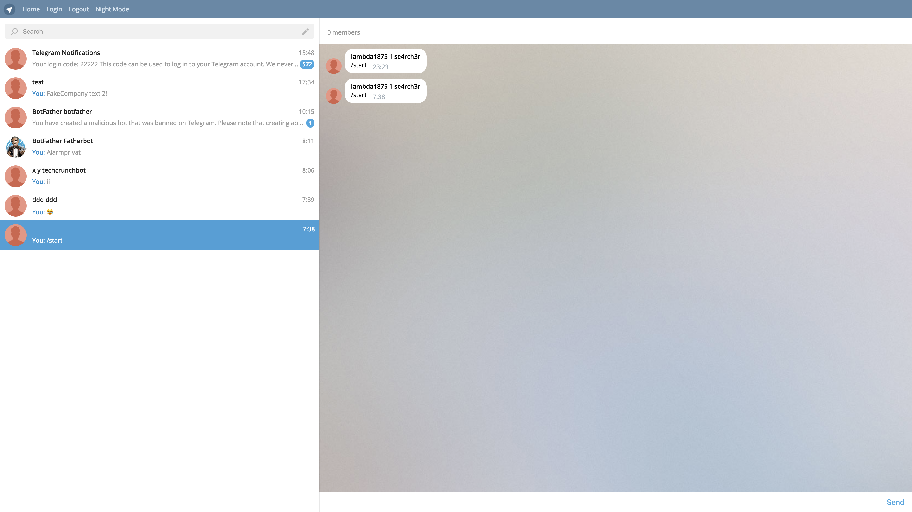

# Telegram React
[](https://travis-ci.org/barbar/vortigern)
[]()
[]()
[](https://codeclimate.com/github/barbar/vortigern)
[](https://github.com/barbar/vortigern/issues)
[](https://raw.githubusercontent.com/barbar/vortigern/develop/LICENSE)
___

**Work in progress** 

Contact me in telegram [@goodmind](https://telegram.me/goodmind)



[](https://www.typescriptlang.org/) 
[](https://github.com/facebook/react) 
[](https://github.com/reactjs/redux)

## Installation

You can clone from this repository

```bash
$ git clone https://github.com/goodmind/treact
$ cd treact
$ npm install
```

## Usage

All commands defaults to development environment. You can set `NODE_ENV` to `production` or use the shortcuts below.

```bash
# Running

$ npm start # This starts the app in development mode

# Starting it with the production build
$ NODE_ENV=production npm start # or
$ npm run start:prod

# Building 

$ npm build # This builds the app in development mode

# Commands below builds the production build
$ NODE_ENV=production npm build # or
$ npm run build:prod

# Testing
$ npm test
```

## Credits

TReact is released under the [MIT license](LICENSE). 
